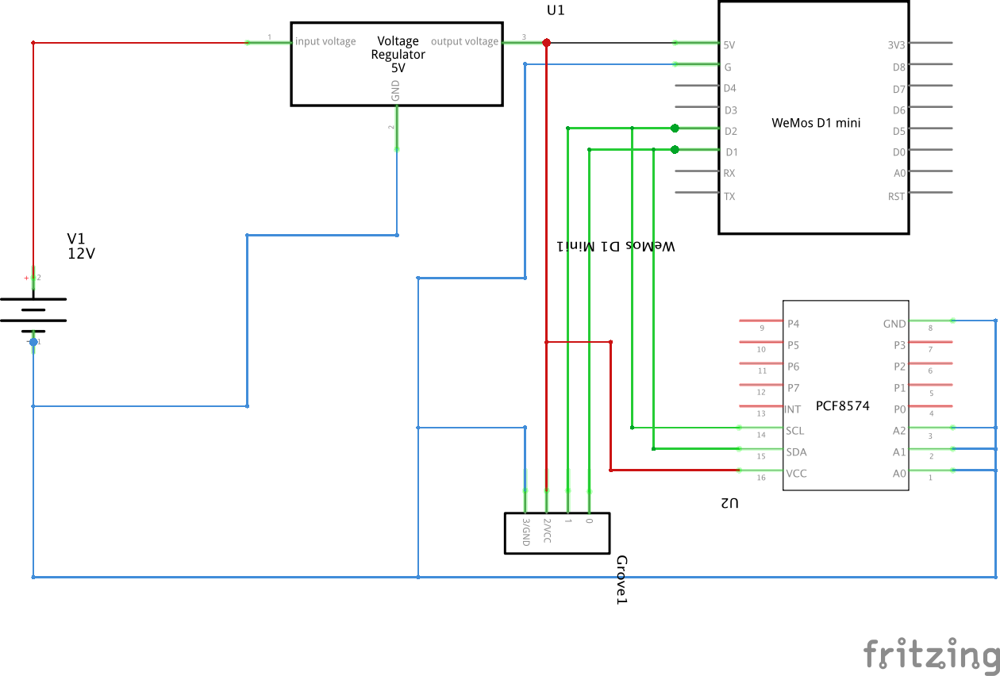

# hydroponic-wemos

## needed hardware

| Summary                       | URL                                                                                                                                       |
|:------------------------------|:------------------------------------------------------------------------------------------------------------------------------------------|
| power supply  12V 1,25A       | https://www.pollin.de/p/hutschienen-schaltnetzteil-meanwell-hdr-15-12-12-v-1-25-a-352109                                                  |
| electricity meter             | https://www.pollin.de/p/wechselstromzaehler-reltech-rwzd1-mid-552954                                                                      |
| step down converter 12V -> 5V | https://www.pollin.de/p/spannungsregler-st-l7805cv-170041                                                                                 |
| power cable                   | https://www.pollin.de/p/netzkabel-mit-schutzkontaktstecker-1-5-m-563230                                                                   |
| water pump 12V                | https://www.pollin.de/p/wasserpumpe-daypower-wp-3203-ip68-12-v-330060                                                                     |
| DIN rail                      | https://www.amazon.de/Mitening-Montageschiene-H%C3%A4ngeschiene-Verteilerschrank-Schaltschrank/dp/B08PKSHZPZ/                             |
| distribution box              | https://www.amazon.de/Kunststoffgeh%C3%A4use-Installationsgeh%C3%A4use-Industriegeh%C3%A4use-transparentem-Verteilerkasten/dp/B00BAA69FE/	|
| terminal block                | https://www.amazon.de/WayinTop-Schraubklemmen-Terminal-L%C3%B6tbare-Steckverbinder/dp/B088FDGBC7/                                         |
| temperature sensor            | https://www.amazon.de/AZDelivery-digitaler-Temperatursensor-Temperaturf%C3%BChler-wasserdicht/dp/B07CZ1G29V                               |
| plant box                     | https://www.bauhaus.info/pflanzkaesten/pflanzkasten/p/22964614                                                                            |
| wooden plate                  | https://www.bauhaus.info/siebdruckplatten/siebdruckplatte-fixmass/p/22594871                                                              |

Additional Hardware:

- Multiplexer PCF8574
- SSD1306 OLED Screen 128x32px
- 4 channel relay breakout board

## pcb layout

- version 1: add base layout

## wemos d1 mini

- [Wemos D1 Mini Layout](https://www.wemos.cc/en/latest/d1/d1_mini.html)

## oled layout

The used OLED uses 128x32px in landscape orientation. For easier management of pixelart, the display is logically divided in 8x2 squares with 16x16px each and used for the following purposes:

| **X**     | **Column 1** | **Column 2**  | **Column 3**      | **Column 4**           | **Column 5**    | **Column 6** |  **Column 7**    | **Column 8**          |
|-----------|:------------:|:-------------:|:-----------------:|:----------------------:|:---------------:|:------------:|:----------------:|:---------------------:|
| **Row 1** | temp icon    | empty         | temp value pipe 1 | temp value pipe 1 unit | pipe state icon | empty        | pipe 1 countdown | pipe 1 countdown unit |
| **Row 2** | temp icon    | empty         | temp value pipe 2 | temp value pipe 2 unit | pipe state icon | empty        | pipe 2 countdown | pipe 2 countdown unit |

Icons are based on the wonderful [Ionicon collection](https://ionicons.com/).

If you want to convert your icons you can use this awesome page: [image2cpp](https://javl.github.io/image2cpp/)